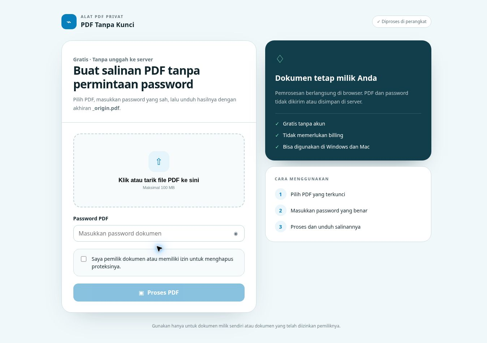
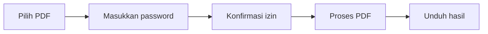

<div align="center">


# PDF Tanpa Kunci

**Buat salinan PDF tanpa permintaan password, langsung di browser.**  
Gratis, tanpa akun, dan dokumen tidak diunggah ke server.

[](https://kikyarfi.github.io/pdf-buka-kunci/)
[](https://kikyarfi.github.io/pdf-buka-kunci/)


</div>

---

## ✨ Tampilan Aplikasi

<div align="center">
  <a href="https://kikyarfi.github.io/pdf-buka-kunci/">
    
  </a>
  <br>
  <sub>Klik gambar untuk membuka aplikasi.</sub>
</div>

## 📌 Navigasi Cepat

- [Tentang aplikasi](#-tentang-aplikasi)
- [Fitur utama](#-fitur-utama)
- [Cara menggunakan](#-cara-menggunakan)
- [Privasi dan keamanan](#-privasi-dan-keamanan)
- [Teknologi](#️-teknologi)
- [Menjalankan secara lokal](#-menjalankan-secara-lokal)
- [Struktur repository](#-struktur-repository)
- [Batasan](#️-batasan)
- [Author](#-author)

## 📖 Tentang Aplikasi

**PDF Tanpa Kunci** adalah aplikasi web ringan untuk membuat salinan PDF tanpa permintaan password. Pengguna tetap harus memasukkan password dokumen yang sah sebelum proteksi dapat dilepas.

Pemrosesan dilakukan menggunakan **qpdf yang dikompilasi ke WebAssembly**. Aplikasi berjalan sepenuhnya di browser dan tidak memerlukan backend.

> [!IMPORTANT]
> Gunakan aplikasi hanya untuk dokumen milik sendiri atau dokumen yang telah diizinkan oleh pemiliknya.

## 🚀 Fitur Utama

| Fitur | Keterangan |
|---|---|
| 🔐 Dekripsi PDF | Membuat salinan PDF menggunakan password yang benar |
| 🖥️ Pemrosesan lokal | File dan password diproses di perangkat pengguna |
| ☁️ Tanpa unggah | Dokumen tidak dikirim ke server aplikasi |
| 🆓 Gratis | Tidak memerlukan akun, billing, atau langganan |
| 📥 Drag and drop | Mendukung klik pilih file dan tarik-lepas |
| 📱 Responsif | Nyaman digunakan pada desktop maupun perangkat seluler |
| 🏷️ Nama otomatis | Hasil disimpan dengan akhiran `_origin.pdf` |
| 🧭 Diagnosis | Menampilkan tahapan error jika pemrosesan gagal |
| 📦 Hingga 100 MB | Validasi ukuran PDF dilakukan sebelum diproses |

## 🧭 Cara Menggunakan



1. Buka **[PDF Tanpa Kunci](https://kikyarfi.github.io/pdf-buka-kunci/)**.
2. Klik area unggah atau tarik file PDF ke halaman.
3. Masukkan password PDF yang benar.
4. Centang konfirmasi kepemilikan atau izin penggunaan dokumen.
5. Klik **Proses PDF**.
6. Klik **Unduh PDF hasil** setelah pemrosesan selesai.

<details>
<summary><strong>💡 Bagaimana nama file hasil dibuat?</strong></summary>

Jika file awal bernama:

```text
dokumen-rahasia.pdf
```

hasilnya akan diunduh sebagai:

```text
dokumen-rahasia_origin.pdf
```

</details>

## 🛡️ Privasi dan Keamanan

Aplikasi ini dirancang dengan pendekatan **local-first processing**:

- PDF dibaca langsung dari perangkat pengguna.
- Password digunakan di dalam browser.
- Dokumen tidak dikirim atau disimpan di server aplikasi.
- Hasil dibuat sebagai URL sementara di memori browser.
- URL sementara dibersihkan ketika file diganti atau halaman ditutup.

> [!NOTE]
> Build qpdf WebAssembly versi tetap `0.3.0` dimuat melalui CDN. File PDF dan password tetap diproses secara lokal dan tidak dikirim ke CDN tersebut.

## 🛠️ Teknologi

| Teknologi | Fungsi |
|---|---|
| HTML5 | Struktur halaman dan input file |
| CSS3 | Desain visual dan tata letak responsif |
| JavaScript | Validasi, interaksi, dan pengunduhan |
| WebAssembly | Menjalankan mesin PDF di browser |
| [qpdf](https://github.com/qpdf/qpdf) | Membaca dan mendekripsi PDF |
| [qpdf-wasm](https://github.com/neslinesli93/qpdf-wasm) | Build qpdf untuk lingkungan browser |
| GitHub Pages | Hosting aplikasi statis |

## 💻 Menjalankan Secara Lokal

### 1. Clone repository

```bash
git clone https://github.com/Kikyarfi/pdf-buka-kunci.git
cd pdf-buka-kunci
```

### 2. Jalankan web server lokal

Menggunakan Python:

```bash
python3 -m http.server 8000
```

Kemudian buka:

```text
http://localhost:8000
```

<details>
<summary><strong>Alternatif: menggunakan VS Code Live Server</strong></summary>

1. Buka folder proyek di VS Code.
2. Instal ekstensi **Live Server**.
3. Klik kanan pada `index.html`.
4. Pilih **Open with Live Server**.

</details>

> [!WARNING]
> Jangan membuka `index.html` langsung melalui protokol `file://`. Gunakan web server lokal agar JavaScript dan WebAssembly dapat berjalan dengan benar.

## 📁 Struktur Repository

| Berkas | Keterangan |
|---|---|
| `index.html` | Tampilan, validasi, dan logika utama aplikasi |
| `favicon.svg` | Logo dan favicon website |
| `og.png` | Gambar preview saat tautan dibagikan |
| `qpdf.js` | Aset JavaScript qpdf lokal |
| `qpdf.wasm` | Aset WebAssembly qpdf lokal |
| `.nojekyll` | Mencegah pemrosesan Jekyll pada GitHub Pages |
| `README.md` | Dokumentasi proyek |

## 🌐 Deploy ke GitHub Pages

<details>
<summary><strong>Lihat langkah deployment</strong></summary>

1. Buka **Settings** pada repository.
2. Pilih menu **Pages**.
3. Pada **Build and deployment**, pilih **Deploy from a branch**.
4. Pilih branch `main` dan folder `/ (root)`.
5. Klik **Save**.
6. Tunggu proses deployment selesai.

Alamat aplikasi:

```text
https://kikyarfi.github.io/pdf-buka-kunci/
```

</details>

## ⚠️ Batasan

- Password PDF harus benar.
- PDF yang rusak mungkin tidak dapat diproses.
- Beberapa jenis proteksi PDF mungkin belum didukung.
- Kecepatan pemrosesan bergantung pada ukuran PDF dan kemampuan perangkat.
- Browser harus mendukung JavaScript dan WebAssembly.
- Batas ukuran file aplikasi saat ini adalah 100 MB.

---

## 👨‍💻 Author

<div align="center">

<a href="https://github.com/Kikyarfi">
  
</a>

### @Kikyarfi

Dibuat dan dikembangkan oleh **[@Kikyarfi](https://github.com/Kikyarfi)**.

[](https://github.com/Kikyarfi)
[](https://github.com/Kikyarfi/pdf-buka-kunci)

<br>

**Jika proyek ini membantu, berikan ⭐ pada repository ini.**

</div>
